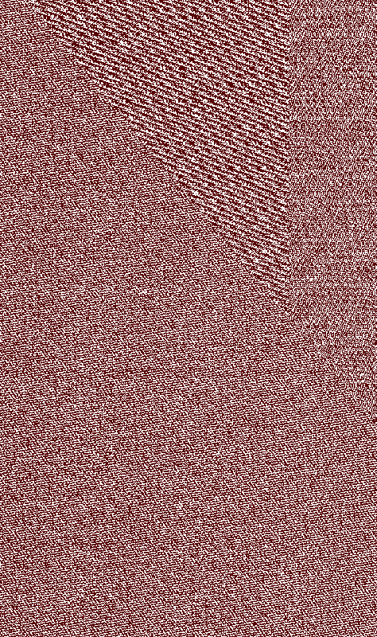
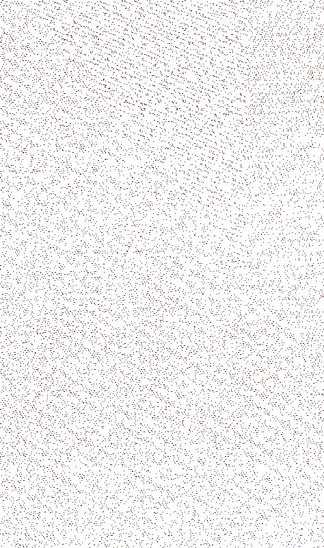

# Monocle

A project for reproducing the Vertical Angle Glitch (VAG) bug in Portal 1.

## Background

VAG is a combination of several bugs that happens for some combinations of
portals when an entity gets very close to the portal boundary. One of the
causes of the bug is floating point rounding errors that happen when a portal
teleports an entity. Reproducing VAGs and predicting when they will happen
is a very frustrating part of speedrun routing.

The best tool we previously had for reproducing VAGs a an IPC script originally
written in [python](https://github.com/UncraftedName/portal1-python-scripts/blob/master/ipc_stuff/vag_searcher.py)
that was then ported to [SPT](https://github.com/YaLTeR/SourcePauseTool/blob/master/spt/features/vag_searcher.cpp)
which would try to teleport the player close to a portal to see if a VAG was
possibly for a specific portal combination. This approach is slow and often
reports false results.

## Goals

### Testing portals for VAGs

The main goal of this project is to provide an environment outside of the game
that can reproduce the conditions needed to check if a VAG is possible on a specific
set of portals. To do this, some math functions had to be replicated in assembly.
You provide the portal positions, angles, which portal was placed first, etc. and the
program will determine if a VAG is possible. There is currently no plan to make
a CLI for this project - I plan on porting it to a more useful format in the future.
See the test scripts for examples.

### Image creation

The old VAG testers only tested for VAGs exactly at the portal center. Then when
trying to reproduce a VAG by hand you discover that it doesn't seem to be possible
in the bottom half of the portal or something. It would be cool if you could figure
out where in a portal a VAG was possible. Here's an example of where in a portal is
VAG is possible for the following portals:
```
ent_fire orange newlocation "874.779541 1159.03931 891.764954  37.8783722 129.905914  0"
ent_fire blue   newlocation "1189.75232 1036.28369 923.913574 -58.4471817 -44.0751495 0"
```

If blue is placed first              | If orange is placed first
:-----------------------------------:|:----------------------------------:
  |  

- white pixels: VAG not possible (normal teleport)
- red pixels: VAG
- grey pixels: you end up teleporting back to the entry portal

Often, these images look very boring. Sometimes a VAG is not possible no matter where
in the portal you enter, sometimes it's possible but only in some sections. And
sometimes you get images like those above (especially if one or both portals has a pitch
and yaw) - you get these Moiré-like patterns that depend on the resolution of the image.


### Complex chains

I hope to reproduce more complex chains of teleports - this has been partially successful.
I can find some valid chains that result in a "double VAG" or a "negative VAG".

For an example:
- load any map
- set the name of your portals using `picker` & `ent_setname` to 'blue' & 'orange'
- noclip
- get into blue's portal bubble in front of it (only necessary on some maps)
- run the following commands in order:
```
ent_fire orange newlocation "283.346893 370.18576   921.384521 0  90 0"
ent_fire blue   newlocation "292.190613  31.7588444 923.996887 0 -90 0"
setpos 292.190613 31.7588463 905.996887
```

This behaves as if the exit portal did 2 teleports.


## Building

I'm using CMake with vs2022. When opening the project with visual studio, the
CMakeSettings.json file should automatically setup 32-bit configurations.
